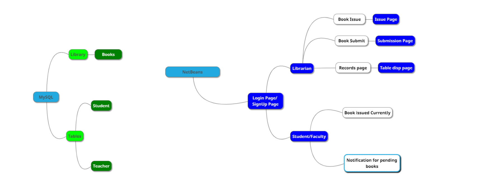
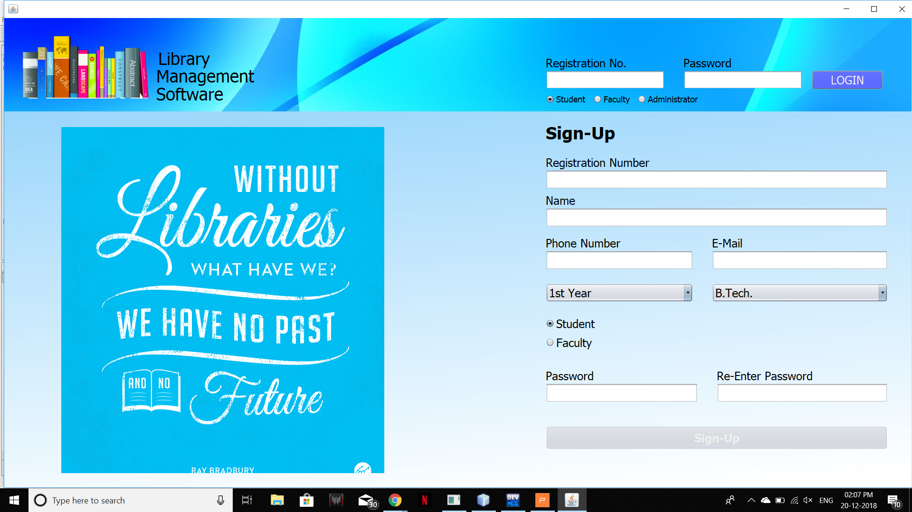
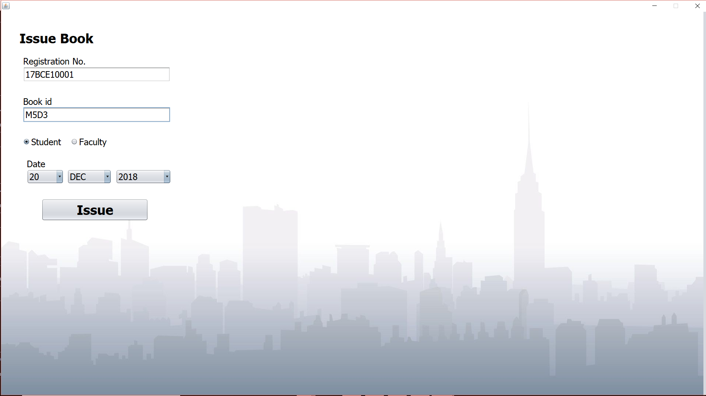
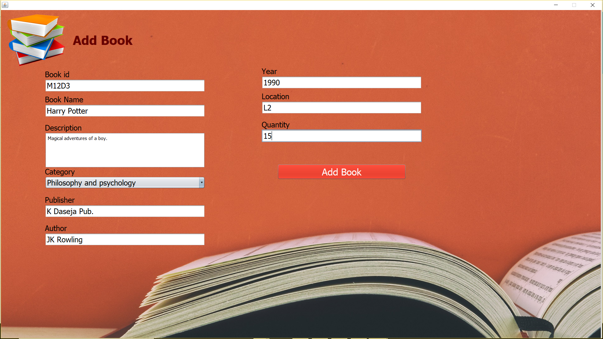
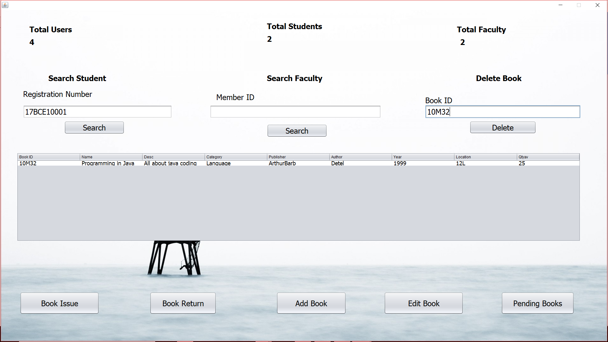
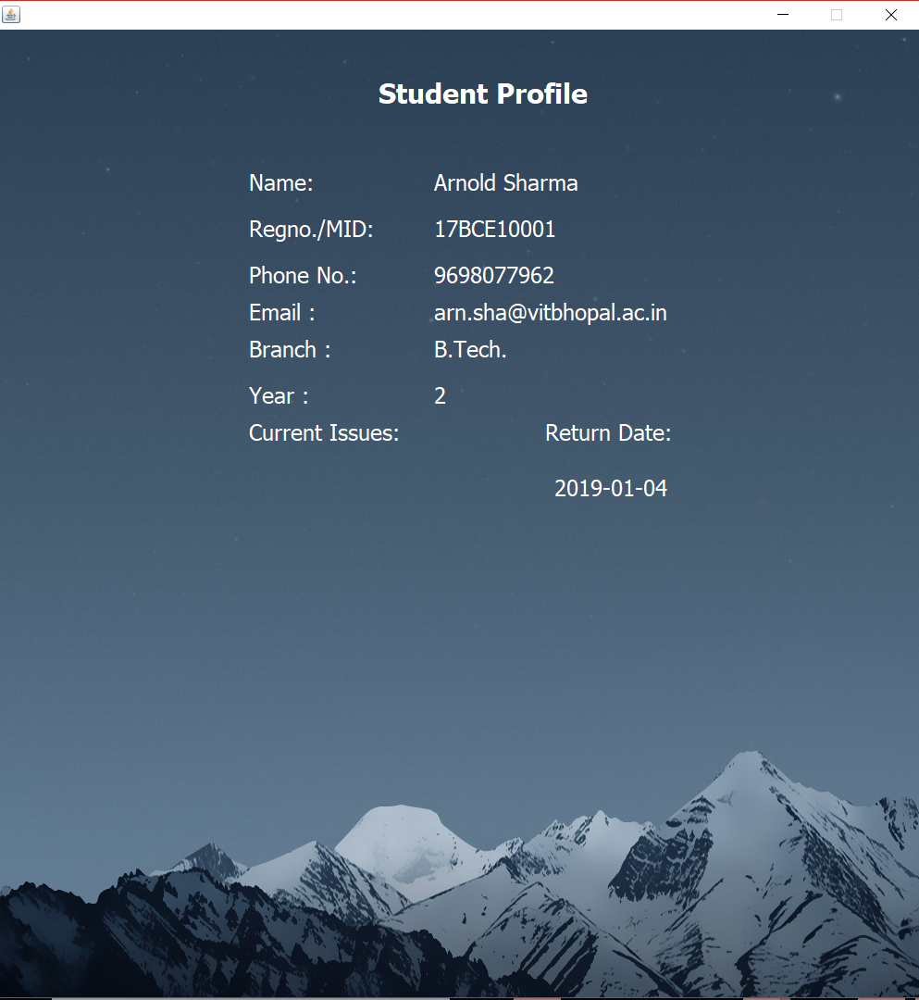

# Library-Management-Software
A software developed in NetBeans using Java to mimic the working of a library at university. Software allows students to issue available books as well as return them, storing all the logs in database(MySQL). On the other hand it reduces the work of management too by easing up some processes like manually checking books, manually issuing books, maintaining proper records, adding new books to records. Moreover, faculties and students have their own profile so they can check their issued book, their limits and other details. All this can be done efficiently now using this software. 

## Mind-map of the Project

## Setup
* Either download [LibrarySoftware.zip](/LibrarySoftware.zip)  and extract to use the software directly(without installing NetBeans).
* Or Clone/Download the whole project and open it using NetBeans.
* To set up database modules, run these at MySQL command line: [MySQL Pre-requsite](/sqlpart.txt)
* Now you can either make changes or run the project as it is.

## Screenshots of Working Project
* **Dashboard**

* **Issue Book**

* **Return Book**

* **Add Book**

* **Admin/Librarian**

* **Result/Info**

